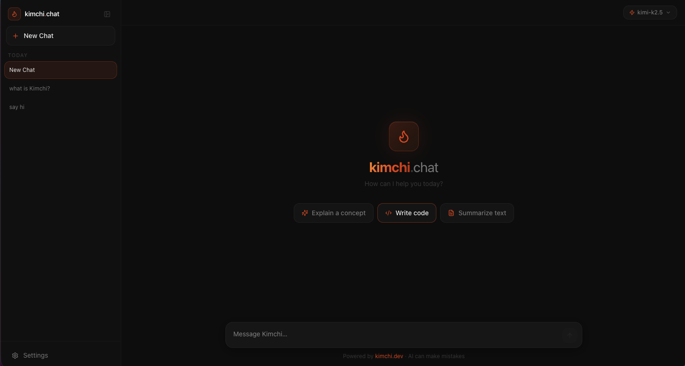

# 🌶 kimchi.chat

A fast, modern chat interface for [kimchi.dev](https://kimchi.dev) — supporting multiple AI models, streaming responses, and a clean dark UI.


---



---

## What is this?

**kimchi.chat** is an open-source web app that lets you chat with AI models via the [kimchi.dev](https://kimchi.dev) API — similar to ChatGPT or Claude, but connected to Kimchi's multi-model infrastructure.

- No subscriptions, no lock-in — just your kimchi.dev API key
- Runs entirely on your machine; your key never leaves your browser session
- Supports all models available on your kimchi.dev account

---

## Quickstart

### Option 1: Native macOS App (Recommended)

Build and run as a native macOS application — no browser needed.

#### Requirements
- [Node.js](https://nodejs.org) v18 or higher
- [Rust](https://rustup.rs) — for Tauri backend
- A kimchi.dev API key — get one at [app.kimchi.dev/settings](https://app.kimchi.dev/settings)

#### Build & Run

```bash
# One-time setup
git clone https://github.com/kisahm/kimchi-chat
cd kimchi-chat
npm install

# Development (hot-reload)
npm run tauri:dev

# Production build (creates Kimchi Chat.app)
npm run tauri:build
```

The native app will be at `src-tauri/target/release/bundle/macos/Kimchi Chat.app`.

A distributable **.dmg installer** is also created at:
- `src-tauri/target/release/bundle/dmg/Kimchi Chat_*.dmg`

For a persistent copy, the latest build is also kept in:
- [`releases/Kimchi-Chat-0.1.0-aarch64.dmg`](./releases/Kimchi-Chat-0.1.0-aarch64.dmg)

See [macOS Build Instructions](.kimchi/docs/macos-build-instructions.md) for code signing, icons, and distribution.

---

### Option 2: Web Browser

Run in your browser via Next.js dev server.

#### Requirements
- [Node.js](https://nodejs.org) v18 or higher
- A kimchi.dev API key — get one at [app.kimchi.dev/settings](https://app.kimchi.dev/settings)

#### 1. Clone the repo

```bash
git clone https://github.com/kisahm/kimchi-chat
cd kimchi-chat
```

#### 2. Start the app

```bash
./start.sh
```

This installs dependencies on first run and opens `http://localhost:3000` in your browser automatically.

> **Alternatively**, if you prefer running manually:
> ```bash
> npm install
> npm run dev
> ```
> Then open [http://localhost:3000](http://localhost:3000).

### 3. Enter your API key

The settings dialog opens automatically on first launch. Paste your kimchi.dev API key and click **Get started** — that's it.

---

## Features

- **Streaming responses** — text appears word by word as it's generated; stop at any time
- **Auto model selection** — Kimchi automatically picks the best model for your request
- **Manual model selector** — switch to any specific model mid-conversation
- **Model badge** — hover over any response to see which model answered
- **Reasoning visibility** — models that think before responding show a collapsible "Reasoning" block
- **Markdown & code** — responses render with full formatting, syntax highlighting, and a copy button
- **Chat history** — all conversations saved locally, with rename and delete support
- **Collapsible sidebar** — hide the sidebar for a distraction-free view
- **Keyboard shortcuts** — `Enter` to send, `Shift+Enter` for a new line

---

## Configuration

Open **Settings** (bottom-left gear icon) at any time to change:

| Setting | Default | Description |
|---|---|---|
| API Key | _(required)_ | Your kimchi.dev API key |
| Base URL | `https://llm.cast.ai/openai/v1` | The API endpoint to connect to |
| Model | Auto | Let Kimchi choose, or pick a specific model |

All settings are saved in your browser's local storage — nothing is stored on any external server.

### Using the local Kimchi harness

If you have the [kimchi CLI](https://github.com/castai/kimchi) running locally (`kimchi`), you can point the Base URL to your local endpoint in Settings to use it as the backend instead.

---

## Troubleshooting

**The app shows "Enter API key in Settings"**
→ Click the **Settings** button in the bottom-left and enter your kimchi.dev API key.

**I'm getting a connection error**
→ Check that your API key is correct and that you have an active kimchi.dev account.

**The model dropdown is empty**
→ This usually means the API key is invalid or the Base URL is wrong. Verify both in Settings.

**`./start.sh` fails with "permission denied"**
→ Run `chmod +x start.sh` first, then try again.

**`./start.sh` fails with "Node.js not found"**
→ Install Node.js v18+ from [nodejs.org](https://nodejs.org), then try again.

---

## Tech stack

| | |
|---|---|
| [Next.js 15](https://nextjs.org) | Framework — server-side API proxy, App Router |
| [Tailwind CSS v4](https://tailwindcss.com) | Styling |
| [Zustand](https://zustand-demo.pmnd.rs) | State management with local persistence |
| [openai](https://github.com/openai/openai-node) | OpenAI-compatible API client (server-side) |
| [react-markdown](https://github.com/remarkjs/react-markdown) | Markdown rendering |
| [lucide-react](https://lucide.dev) | Icons |
| [Tauri v2](https://tauri.app) | Native desktop app (Rust + WebView) |

---

## Why does this need a local server?

The kimchi.dev API blocks direct requests from browsers (CORS policy). The Next.js dev server acts as a lightweight local proxy — it forwards your requests to the API server-side. Your API key is only ever used on your own machine and is never sent anywhere else.

---

## License

MIT — see [LICENSE](./LICENSE)
